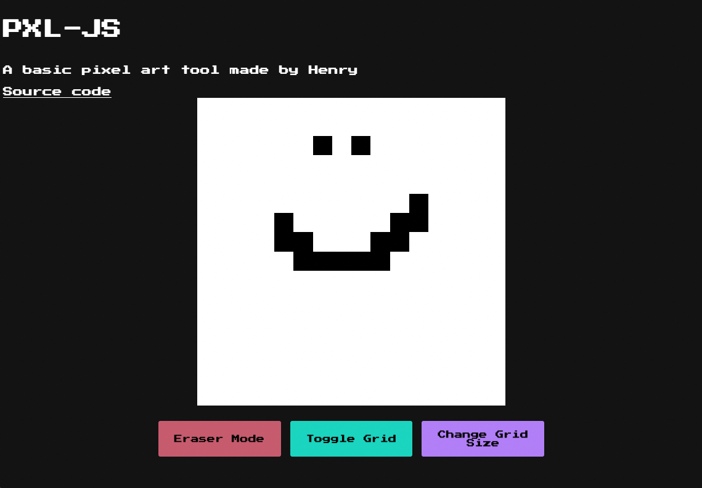

# PXL-JS ✏️

## Overview

`PXL-JS` is a simplistic web-based pixel art tool  

It was made as part of the curriculum of `The Odin Project`  

 

---

 

## Current Features
The site in its current form has the ability to draw on an adjustable canvas and erase the content, which is limited to black pixels for now.

 

In future, I would like to expand on this project, by adding the ability to export the drawn image, and add the ability to use different colours  

As my ability increases, I also hope to add tools such as marquee selection and shape-restricted drawing (square tool etc)
